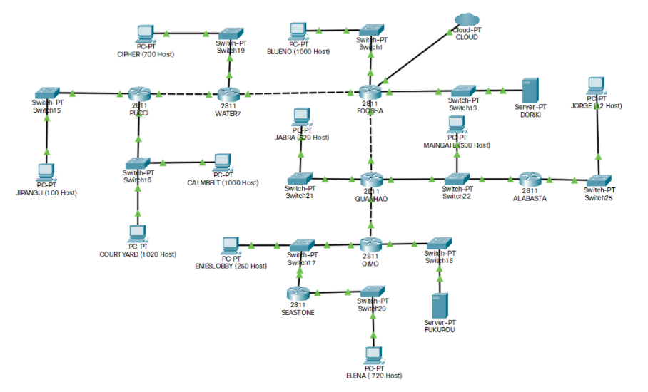
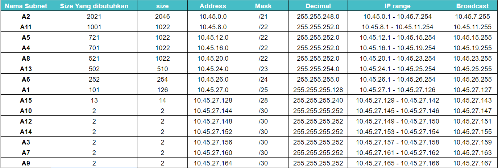
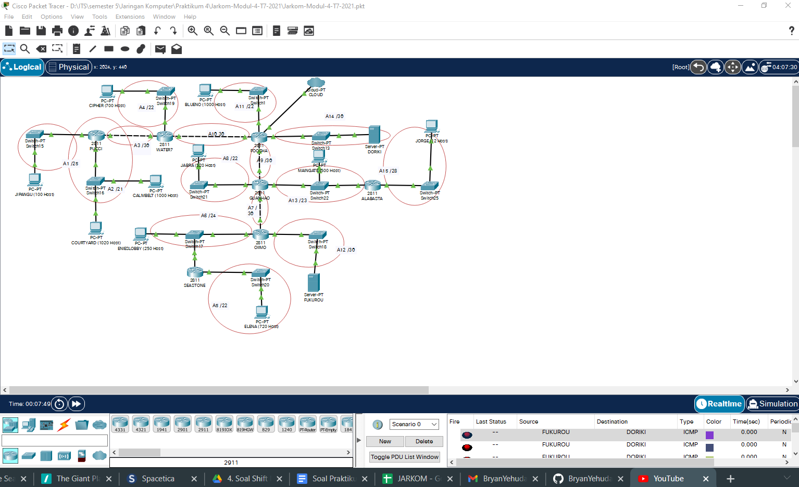
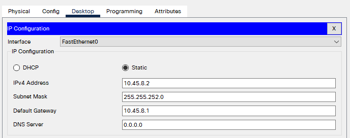
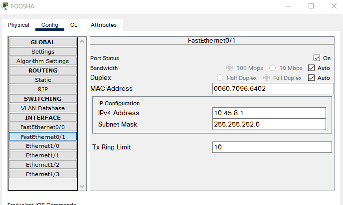
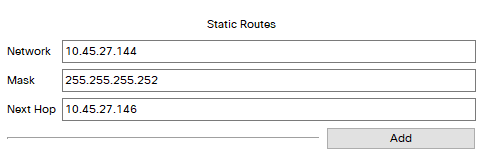
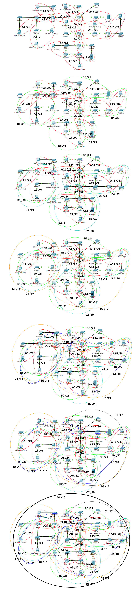
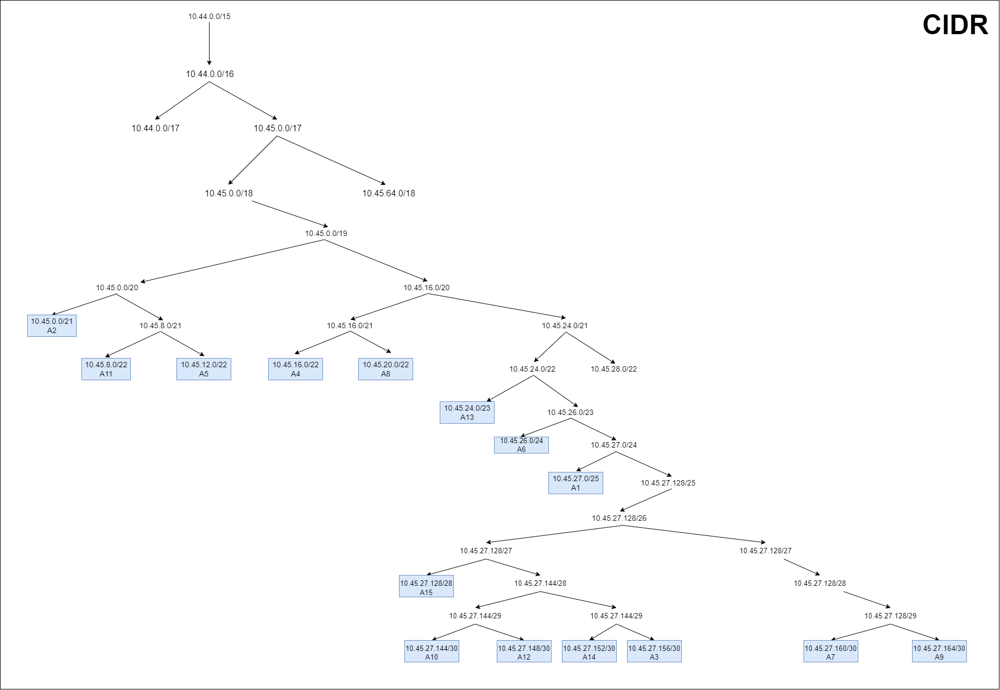

# Jarkom-Modul-4-T7-2021
Ini adalah repository yang dibuat untuk menampung Jawaban Soal Jarkom Modul 2  Topics Resources  
#### Nama Anggota Kelompok :      
1. Naufal Aprilian (05311940000007)     
2. Bryan Yehuda Mannuel (05311940000021)      
3. Mulki Kusumah (05311940000043)

## Jawaban Modul 
## Soal
Berikut adalah topologi yang harus dibuat

1. Soal shift dikerjakan pada Cisco Packet Tracer dan GNS3 menggunakan metode perhitungan CLASSLESS yang berbeda.
2. Keterangan: Bila di CPT menggunakan VLSM, maka di GNS3 menggunakan CIDR atau Sebaliknya
3. Jika tidak ada pemberitahuan revisi soal dari asisten, berarti semua soal BERSIFAT BENAR dan DAPAT DIKERJAKAN.
4. Untuk di GNS3 CLOUD merupakan NAT1 jangan sampai salah agar bisa terkoneksi internet.
5. Pembagian IP menggunakan Prefix IP yang telah ditentukan pada modul pengenalan
6. Pembagian IP dan routing harus SE-EFISIEN MUNGKIN.
7. Pastikan semua NODE pada GNS3 dapat melakukan ping ke its.ac.id

## Jawaban
### Metode VLSM
Hal pertama yang kami lakukan adalah dengan menentukan subnet yang ada pada topologi. Dikarenakan metode yang dipakai adalah VLSM. Kami melingkari tiap host yang terhubung pada interface router dan menghitung IP yang dibutuhkan. Berikut alah gambaran pembagian subnetnya

Setelah melakukan pembagian subnet kita juga sudah melakukan perhitungan untuk pembagaian IPnya. Berikut adalah perhitungannya

Setelah Melakukan perhitungan kita mencoba untuk membuat sebuah tree. Hasilnya adalah sebagai berikut

Setelah semuanya sudah selesai tinggal melakukan konfigurasi pada packet tracer

Melakukan Assign seluruh Host dan Interface Router sesuai dengan tabel perhitungan yang telah dibuat
Untuk melakukan Assign contohnya adalah sebagai berikut:
1. Pada bagian Host/ Server buka Desktop, Ip Configuration lalu isikan:
IP4 address: [IP Host]
Subnet Mask: [Subnet pada bagian tersebut]
Gateway: [IP Router Interface yang terhubung ke host]
Contohnya pada Host PC-PT BLUENO yang terhubung dengan Router Water7 terletak pada subnet A11

2. Pada bagian Router melakukan Assign terhadap IP Address dan subnet mask interface router tersebut.
Contohnya adalah pada bagian Router Fosha yang terhubung degan Host PC-PT BLUENO. Konfigurasinya adalah sebagai berikut:

3. Jika Router terhubung dengan router agi dapat dilakukan Routing. Cara melakukan konfigurasinya adalah dengan masuk pada config ROUTING. Disana dapat mengisikan Netrwork , Mask, dan Next Hop yang ditujukan
Contohnya adalah pada bagian Router Fosha yang terhubung dengan router Water7:
Maka Konfigurasi pada Router Fosha adalah sebagai berikut:

Selanjutnya untuk seluruh konfigurasi yang telah kita lakukan dapat dilihat di file packet tracer kami

### Metode CIDR
Berikut adalah Hasil Perhitungan kami terhadap Metodologi CIDR

Dengan begitu kita dapat menentukan tree untuk metodologi CIDR tersebut hasilnya adalah sebagai berikut:

Kami juga sudah membuat topologi untuk gns3 nya tapi belum sempat untuk melakukan konfigurasi routingnya yang berada pada folder gns3

Setelah melakukan pembagian subnet kita juga sudah melakukan perhitungan untuk pembagaian IPnya. Berikut adalah perhitungannya

## Kendala
Kami tidak sempat untuk mengerjakan dengan Metode CIDR, Terima kasih     
Kelompok kami sudah berusaha melakukan perhitungan dan membuat topologi di GNS 3 tetapi masih belum bisa mengerjakannya   
Untuk hasil perhitungan sementara ada di bagian atas dan GNS3 untuk topologinya sudah ditambahkan
